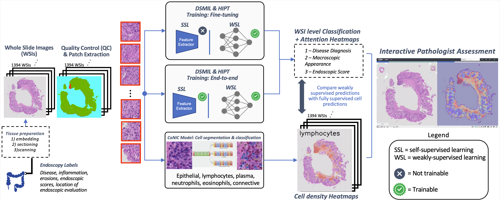

# IBD-INTERPRET: IBD-INTERpretable PRediction of disease-relevant fEaTures

Code for the paper "Interpretable histopathology-based prediction of disease relevant features in Inflammatory Bowel Disease biopsies using weakly-supervised deep learning" - Accepted for publication at MIDL 2023

### Abstract

**Crohn’s Disease (CD) and Ulcerative Colitis (UC) are the two main Inflammatory Bowel Disease (IBD) types. We developed interpretable deep learning models to identify histolog- ical disease features for both CD and UC using only endoscopic labels. We explored fine- tuning and end-to-end training of two state-of-the-art self-supervised models for predicting three different endoscopic categories (i) CD vs UC (AUC=0.87), (ii) normal vs lesional (AUC=0.81), (iii) low vs high disease severity score (AUC=0.80). With the support of a pathologist, we explored the relationship between endoscopic labels, model predictions and histological evaluations qualitatively and quantitatively and identified cases where the pathologist’s descriptions of inflammation were consistent with regions of high attention. In parallel, we used a model trained on the Colon Nuclei Identification and Counting (CoNIC) dataset to predict and explore 6 cell populations. We observed consistency between areas enriched with the predicted immune cells in biopsies and the pathologist’s feedback on the attention maps. Finally, we identified several cell level features indicative of disease severity in CD and UC. These models can enhance our understanding about the pathology behind IBD and can shape our strategies for patient stratification in clinical trials.**

### Citation

Coming soon.
